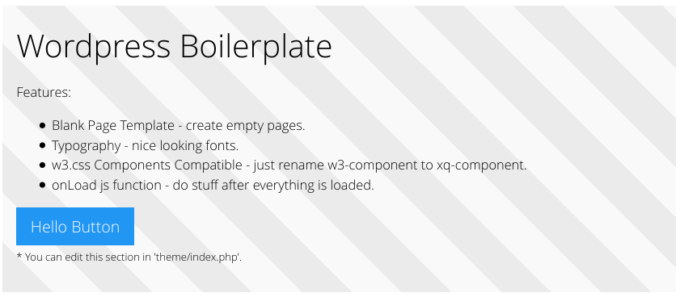

# XQ (dsijakXq)

## About XQ

XQ is an Wordpress boilerplate starter theme. Theme is compatible with w3.css and
that means that you can simply use w3.css components by simply renaming
w3-component class name to xq-component. 

Theme also allows you to use blank pages. That means that can have html
only pages without wordpress elements. To use this, when creating pages select 'Blank Template'.

## About Css

Xq css is basically w3.css but extended with additional classes.

## Install

Place theme into 'wordpress/wp-content/themes/' folder.

## License

This theme is licensed under MIT. You can feel free to modify it as 
long as you keep the original copyright information.

## Have fun
